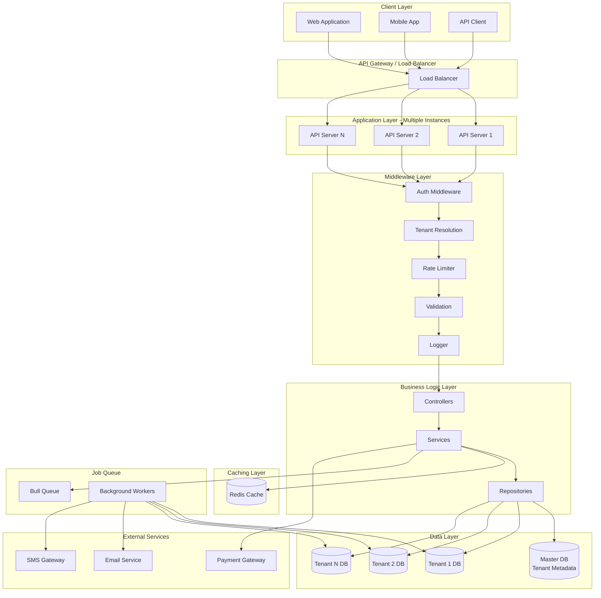
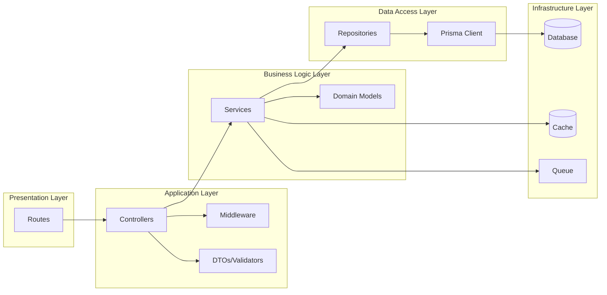
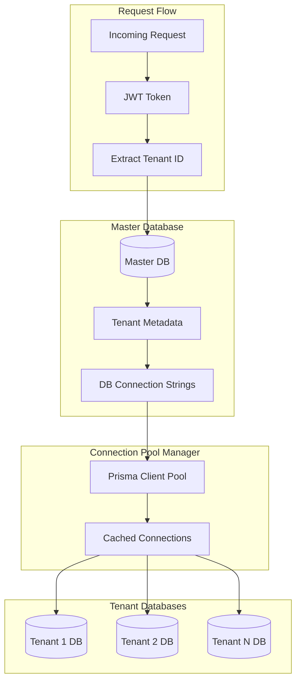
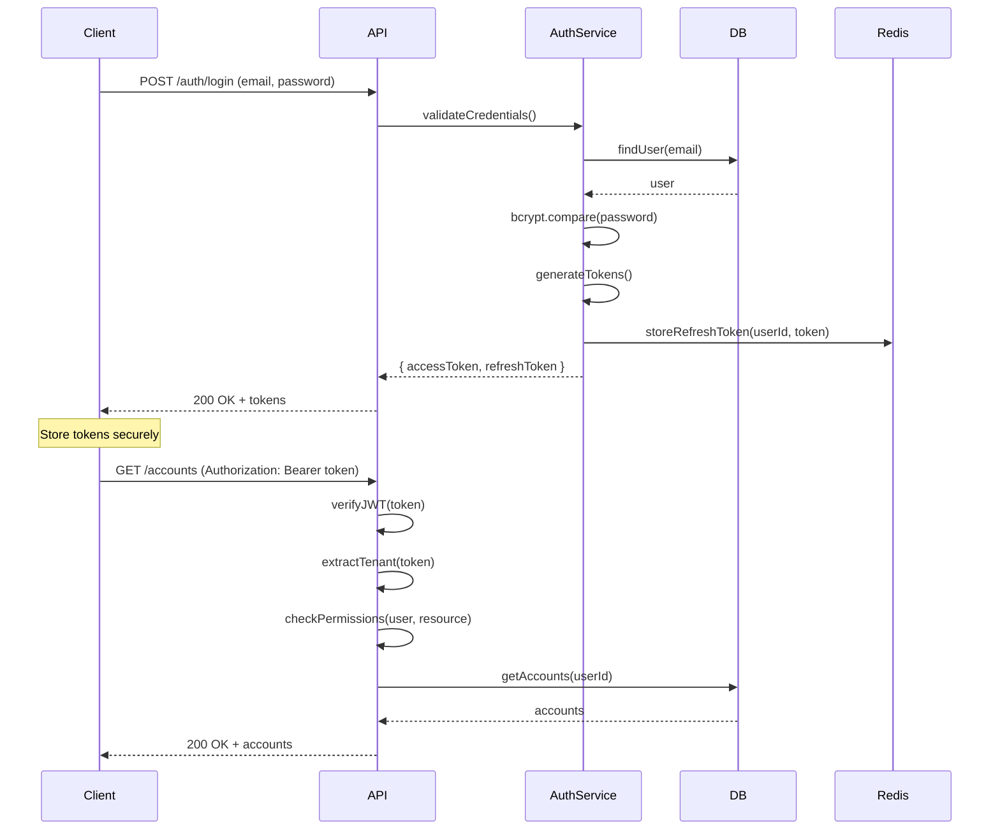
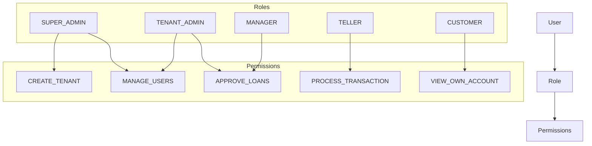
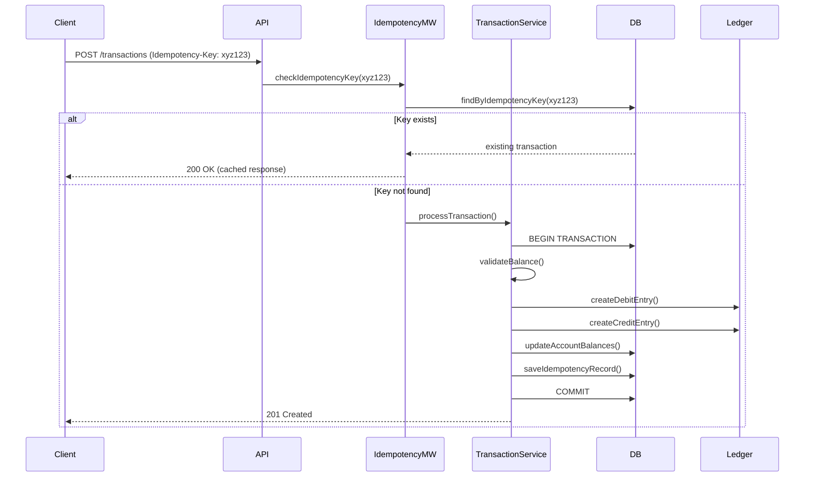
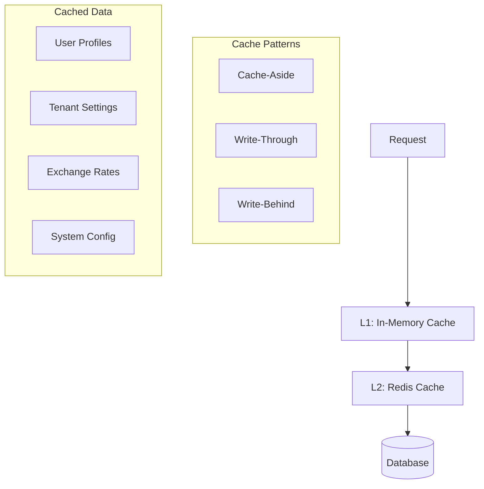
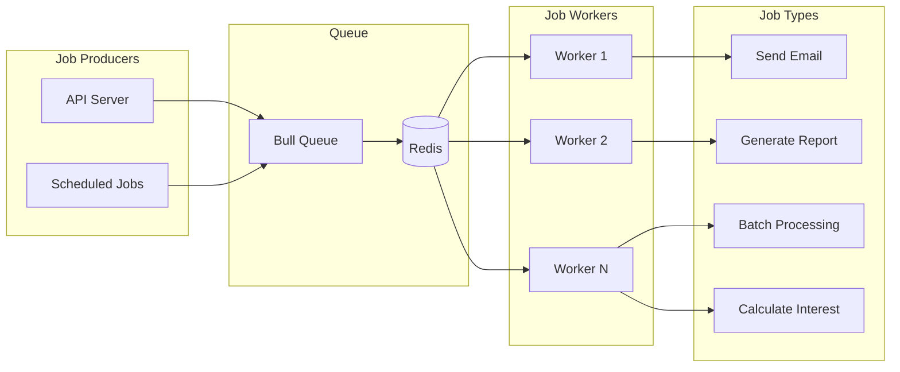
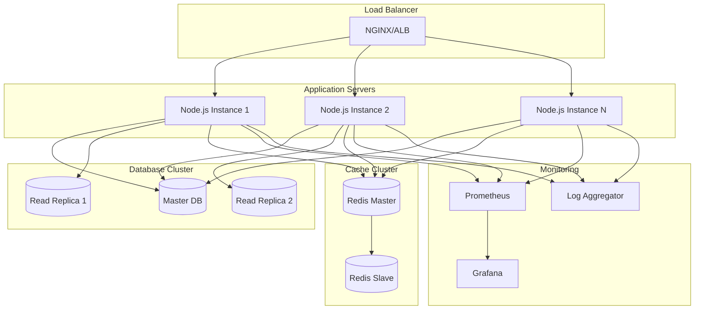

# System Architecture - Core Banking API

## 1. Architecture Overview

This document outlines the high-level system architecture for the core banking API, designed with enterprise-grade patterns for scalability, security, and maintainability.

### 1.1 Architecture Style
- **Layered Architecture**: Clear separation of concerns across layers
- **Multi-tenant Architecture**: Database-per-tenant for complete data isolation
- **RESTful API**: Standard HTTP-based API design
- **Event-Driven**: Async processing for notifications and batch jobs

### 1.2 Technology Stack

#### Backend
- **Runtime**: Node.js (v20 LTS)
- **Framework**: Express.js
- **Language**: JavaScript (with JSDoc for type hints) or TypeScript
- **ORM**: Prisma
- **Database**: PostgreSQL 15+
- **Cache**: Redis
- **Queue**: Bull (Redis-based job queue)

#### Security & Auth
- **Authentication**: JWT (jsonwebtoken)
- **Password Hashing**: bcrypt
- **Encryption**: crypto (Node.js native)
- **Security Headers**: Helmet.js
- **Rate Limiting**: express-rate-limit + Redis

#### Validation & DTOs
- **Validation**: Joi or Zod
- **Sanitization**: express-validator

#### Documentation
- **API Docs**: Swagger/OpenAPI (swagger-jsdoc + swagger-ui-express)
- **Code Docs**: JSDoc

#### Testing
- **Test Framework**: Jest
- **API Testing**: Supertest
- **Mocking**: jest.mock()
- **Test DB**: PostgreSQL (separate test database)

#### Logging & Monitoring
- **Logging**: Winston or Pino
- **Request Logging**: Morgan
- **Metrics**: prom-client (Prometheus)

#### Reporting
- **PDF Generation**: PDFKit
- **Excel Generation**: ExcelJS

---

## 2. System Architecture Diagram



---

## 3. Layered Architecture

### 3.1 Layer Responsibilities



#### Routes Layer
- Define API endpoints and HTTP methods
- Map URLs to controller methods
- Apply route-level middleware
- Group related endpoints

#### Controllers Layer
- Handle HTTP request/response
- Validate request data using DTOs
- Call appropriate service methods
- Format responses
- Handle HTTP-specific concerns (status codes, headers)

#### Services Layer
- Implement business logic
- Orchestrate multiple repositories
- Handle transactions
- Implement idempotency
- Trigger events/jobs
- Independent of HTTP (can be used by CLI, jobs, etc.)

#### Repositories Layer
- Abstract data access
- Encapsulate Prisma queries
- Handle database-specific logic
- Provide clean interface to services

#### Infrastructure Layer
- Database connections
- Cache management
- Queue management
- External service integrations

---

## 4. Multi-tenancy Architecture

### 4.1 Database-per-Tenant Strategy



### 4.2 Tenant Resolution Flow

1. **Request arrives** with JWT token or subdomain
2. **Extract tenant identifier** from token payload or subdomain
3. **Validate tenant** exists and is active (check master DB)
4. **Get database connection** from pool or create new connection
5. **Execute request** against tenant-specific database
6. **Return response** to client

### 4.3 Master Database Schema

Stores tenant metadata and routing information:

```prisma
model Tenant {
  id                String   @id @default(uuid())
  name              String
  slug              String   @unique
  dbHost            String
  dbPort            Int
  dbName            String
  dbUser            String
  dbPassword        String   // Encrypted
  status            TenantStatus @default(ACTIVE)
  settings          Json     // Tenant-specific config
  createdAt         DateTime @default(now())
  updatedAt         DateTime @updatedAt
}

enum TenantStatus {
  ACTIVE
  INACTIVE
  SUSPENDED
}
```

### 4.4 Tenant Database Schema

Each tenant database contains:
- Users
- Customers
- Accounts
- Transactions
- Ledger entries
- All business entities

---

## 5. Security Architecture

### 5.1 Authentication Flow



### 5.2 Authorization (RBAC)



---

## 6. Transaction Processing Architecture

### 6.1 Idempotent Transaction Flow



### 6.2 Double-Entry Bookkeeping

Every transaction creates balanced ledger entries:

```
Transaction: Transfer $100 from Account A to Account B

Ledger Entries:
1. Debit:  Account A  -$100  (Asset decrease)
2. Credit: Account B  +$100  (Asset increase)

Sum: -$100 + $100 = $0 (Balanced)
```

---

## 7. Caching Strategy

### 7.1 Cache Layers



### 7.2 Cache Invalidation

- **Time-based expiration**: TTL for each cache entry
- **Event-based invalidation**: Clear cache on data updates
- **Pattern-based invalidation**: Clear related cache keys

---

## 8. Background Job Architecture

### 8.1 Job Queue System



---

## 9. Error Handling Strategy

### 9.1 Error Hierarchy

```javascript
// Base error class
class AppError extends Error {
  constructor(message, statusCode, isOperational = true) {
    super(message);
    this.statusCode = statusCode;
    this.isOperational = isOperational;
    Error.captureStackTrace(this, this.constructor);
  }
}

// Specific error types
class ValidationError extends AppError {
  constructor(message, errors) {
    super(message, 400);
    this.errors = errors;
  }
}

class UnauthorizedError extends AppError {
  constructor(message = 'Unauthorized') {
    super(message, 401);
  }
}

class NotFoundError extends AppError {
  constructor(resource) {
    super(`${resource} not found`, 404);
  }
}

class ConflictError extends AppError {
  constructor(message) {
    super(message, 409);
  }
}
```

### 9.2 Global Error Handler

```javascript
// Centralized error handling middleware
app.use((err, req, res, next) => {
  logger.error(err);
  
  if (err.isOperational) {
    // Trusted error - send to client
    res.status(err.statusCode).json({
      status: 'error',
      message: err.message,
      errors: err.errors
    });
  } else {
    // Programming error - don't leak details
    res.status(500).json({
      status: 'error',
      message: 'Internal server error'
    });
  }
});
```

---

## 10. API Design Principles

### 10.1 RESTful Conventions

| Method | Endpoint | Description | Idempotent |
|--------|----------|-------------|------------|
| GET | /api/v1/accounts | List accounts | ✅ |
| GET | /api/v1/accounts/:id | Get account | ✅ |
| POST | /api/v1/accounts | Create account | ❌ |
| PUT | /api/v1/accounts/:id | Update account | ✅ |
| PATCH | /api/v1/accounts/:id | Partial update | ✅ |
| DELETE | /api/v1/accounts/:id | Delete account | ✅ |
| POST | /api/v1/transactions | Create transaction | ✅* |

*Idempotent with idempotency key

### 10.2 Response Format

```json
{
  "status": "success",
  "data": {
    "account": {
      "id": "acc_123",
      "accountNumber": "1234567890",
      "balance": 1000.00,
      "currency": "USD"
    }
  },
  "meta": {
    "timestamp": "2025-12-23T13:57:02Z",
    "requestId": "req_xyz789"
  }
}
```

### 10.3 Error Response Format (RFC 7807)

```json
{
  "type": "https://api.bank.com/errors/insufficient-funds",
  "title": "Insufficient Funds",
  "status": 400,
  "detail": "Account balance is insufficient for this transaction",
  "instance": "/api/v1/transactions/txn_123",
  "balance": 50.00,
  "required": 100.00
}
```

---

## 11. Deployment Architecture

### 11.1 Infrastructure



---

## 12. Key Design Decisions

### 12.1 Why Database-per-Tenant?
- **Pros**: Complete isolation, independent scaling, easier compliance
- **Cons**: More complex connection management, higher infrastructure cost
- **Decision**: Security and compliance outweigh cost for banking

### 12.2 Why Express.js over NestJS?
- **Pros**: Lightweight, flexible, easier to understand patterns
- **Cons**: Less opinionated, requires more setup
- **Decision**: Better for learning fundamentals without framework magic

### 12.3 Why Prisma over TypeORM?
- **Pros**: Type-safe, excellent DX, migration system, multi-DB support
- **Cons**: Newer, smaller ecosystem
- **Decision**: Modern approach, better for multi-tenancy

### 12.4 Why Redis for Caching?
- **Pros**: Fast, distributed, supports complex data structures
- **Cons**: Additional infrastructure
- **Decision**: Industry standard, essential for horizontal scaling

---

## 13. Next Steps

1. Review and approve architecture
2. Set up project folder structure
3. Initialize Node.js project with dependencies
4. Configure Prisma with master and tenant schemas
5. Implement authentication and multi-tenancy foundation
6. Build core banking features incrementally
