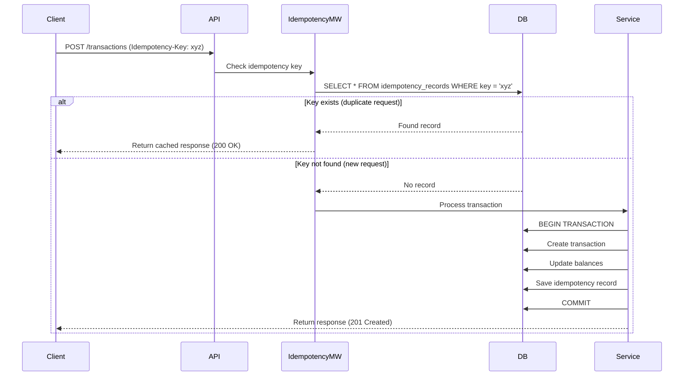

# Idempotency Implementation Guide

## 1. What is Idempotency?

**Idempotency** ensures that performing the same operation multiple times produces the same result as performing it once. This is critical in banking to prevent duplicate transactions due to:
- Network retries
- User double-clicks
- System failures during processing

## 2. Why Idempotency Matters in Banking

### 2.1 Problem Scenario

```
User initiates $100 transfer
  ↓
Request sent to server
  ↓
Server processes transaction
  ↓
Response lost due to network timeout
  ↓
Client retries request
  ↓
Server processes AGAIN (duplicate!)
  ↓
User charged $200 instead of $100 ❌
```

### 2.2 With Idempotency

```
User initiates $100 transfer (Idempotency-Key: abc123)
  ↓
Request sent to server
  ↓
Server checks if abc123 exists → NO
  ↓
Server processes transaction & stores abc123
  ↓
Response lost due to network timeout
  ↓
Client retries with SAME Idempotency-Key: abc123
  ↓
Server checks if abc123 exists → YES
  ↓
Server returns cached response (no duplicate) ✅
```

---

## 3. Implementation Strategy

### 3.1 Idempotency Key

Clients must send a unique idempotency key with each request:

```http
POST /api/v1/transactions
Content-Type: application/json
Idempotency-Key: 550e8400-e29b-41d4-a716-446655440000

{
  "fromAccountId": "acc_123",
  "toAccountId": "acc_456",
  "amount": 100.00,
  "currency": "USD"
}
```

### 3.2 Server-Side Processing Flow



---

## 4. Database Schema

### 4.1 Idempotency Records Table

```prisma
model IdempotencyRecord {
  id                String          @id @default(uuid())
  idempotencyKey    String          @unique
  
  // Request details
  endpoint          String          // e.g., "/api/v1/transactions"
  method            String          // e.g., "POST"
  requestBody       Json?
  
  // Response details
  responseStatus    Int             // e.g., 201
  responseBody      Json?
  
  // Metadata
  userId            String?
  ipAddress         String?
  
  createdAt         DateTime        @default(now())
  expiresAt         DateTime        // Auto-delete after 24 hours
  
  @@index([idempotencyKey])
  @@index([expiresAt])
}
```

---

## 5. Middleware Implementation

### 5.1 Idempotency Middleware

```javascript
// src/api/middleware/idempotency.middleware.js
const { PrismaClient } = require('@prisma/client');
const { v4: uuidv4 } = require('uuid');

class IdempotencyMiddleware {
  constructor() {
    this.prisma = new PrismaClient();
  }
  
  /**
   * Middleware to check and enforce idempotency
   * Only applies to POST, PUT, PATCH, DELETE methods
   */
  checkIdempotency = async (req, res, next) => {
    // Only check idempotency for state-changing operations
    if (!['POST', 'PUT', 'PATCH', 'DELETE'].includes(req.method)) {
      return next();
    }
    
    const idempotencyKey = req.headers['idempotency-key'];
    
    // Require idempotency key for critical endpoints
    if (this.requiresIdempotencyKey(req.path) && !idempotencyKey) {
      return res.status(400).json({
        status: 'error',
        message: 'Idempotency-Key header is required for this operation'
      });
    }
    
    if (!idempotencyKey) {
      return next();
    }
    
    try {
      // Check if this idempotency key has been used before
      const existing = await this.prisma.idempotencyRecord.findUnique({
        where: { idempotencyKey }
      });
      
      if (existing) {
        // Return cached response
        return res.status(existing.responseStatus).json(existing.responseBody);
      }
      
      // Store idempotency key for this request
      req.idempotencyKey = idempotencyKey;
      
      // Intercept response to cache it
      const originalJson = res.json.bind(res);
      res.json = async (body) => {
        // Save idempotency record
        await this.saveIdempotencyRecord({
          idempotencyKey,
          endpoint: req.path,
          method: req.method,
          requestBody: req.body,
          responseStatus: res.statusCode,
          responseBody: body,
          userId: req.user?.id,
          ipAddress: req.ip
        });
        
        return originalJson(body);
      };
      
      next();
    } catch (error) {
      console.error('Idempotency check error:', error);
      next(error);
    }
  };
  
  /**
   * Determine if endpoint requires idempotency key
   */
  requiresIdempotencyKey(path) {
    const criticalEndpoints = [
      '/api/v1/transactions',
      '/api/v1/transfers',
      '/api/v1/payments'
    ];
    
    return criticalEndpoints.some(endpoint => path.startsWith(endpoint));
  }
  
  /**
   * Save idempotency record to database
   */
  async saveIdempotencyRecord(data) {
    const expiresAt = new Date();
    expiresAt.setHours(expiresAt.getHours() + 24); // Expire after 24 hours
    
    await this.prisma.idempotencyRecord.create({
      data: {
        ...data,
        expiresAt
      }
    });
  }
}

module.exports = new IdempotencyMiddleware();
```

### 5.2 Apply Middleware

```javascript
// src/app.js
const express = require('express');
const idempotencyMiddleware = require('./api/middleware/idempotency.middleware');

const app = express();

// Apply idempotency middleware globally
app.use(idempotencyMiddleware.checkIdempotency);

// Routes
app.use('/api/v1', routes);

module.exports = app;
```

---

## 6. Service-Level Idempotency

### 6.1 Transaction Service with Idempotency

```javascript
// src/services/transaction.service.js
const transactionRepository = require('../repositories/transaction.repository');
const ledgerService = require('./ledger.service');
const { InsufficientFundsError, ValidationError } = require('../utils/errors');

class TransactionService {
  /**
   * Process a transfer with idempotency
   */
  async transfer({ fromAccountId, toAccountId, amount, description, idempotencyKey, createdBy, tenantId }) {
    // Check if transaction already exists with this idempotency key
    if (idempotencyKey) {
      const existing = await transactionRepository.findByIdempotencyKey(idempotencyKey, tenantId);
      if (existing) {
        // Return existing transaction (idempotent)
        return existing;
      }
    }
    
    // Validate amount
    if (amount <= 0) {
      throw new ValidationError('Amount must be greater than zero');
    }
    
    // Start database transaction
    return await transactionRepository.executeInTransaction(async (prisma) => {
      // Lock accounts to prevent race conditions
      const fromAccount = await prisma.account.findUnique({
        where: { id: fromAccountId }
      });
      
      const toAccount = await prisma.account.findUnique({
        where: { id: toAccountId }
      });
      
      if (!fromAccount || !toAccount) {
        throw new ValidationError('Invalid account');
      }
      
      // Check sufficient balance
      if (fromAccount.balance < amount) {
        throw new InsufficientFundsError('Insufficient funds');
      }
      
      // Create transaction record
      const transaction = await prisma.transaction.create({
        data: {
          transactionRef: this.generateTransactionRef(),
          idempotencyKey,
          type: 'TRANSFER',
          amount,
          fromAccountId,
          toAccountId,
          description,
          status: 'COMPLETED',
          processedAt: new Date(),
          createdBy
        }
      });
      
      // Create ledger entries (double-entry bookkeeping)
      await ledgerService.createLedgerEntries({
        transactionId: transaction.id,
        debitAccountId: fromAccountId,
        creditAccountId: toAccountId,
        amount,
        prisma
      });
      
      // Update account balances
      await prisma.account.update({
        where: { id: fromAccountId },
        data: { balance: { decrement: amount } }
      });
      
      await prisma.account.update({
        where: { id: toAccountId },
        data: { balance: { increment: amount } }
      });
      
      return transaction;
    }, tenantId);
  }
  
  generateTransactionRef() {
    const date = new Date().toISOString().split('T')[0].replace(/-/g, '');
    const random = Math.floor(Math.random() * 1000000).toString().padStart(6, '0');
    return `TXN-${date}-${random}`;
  }
}

module.exports = new TransactionService();
```

---

## 7. Client-Side Implementation

### 7.1 Generate Idempotency Key

```javascript
// Client-side (React/Vue/etc.)
import { v4 as uuidv4 } from 'uuid';

async function transferMoney(fromAccount, toAccount, amount) {
  const idempotencyKey = uuidv4(); // Generate unique key
  
  try {
    const response = await fetch('/api/v1/transactions', {
      method: 'POST',
      headers: {
        'Content-Type': 'application/json',
        'Authorization': `Bearer ${token}`,
        'Idempotency-Key': idempotencyKey
      },
      body: JSON.stringify({
        fromAccountId: fromAccount,
        toAccountId: toAccount,
        amount
      })
    });
    
    if (!response.ok) {
      throw new Error('Transfer failed');
    }
    
    return await response.json();
  } catch (error) {
    // Retry with SAME idempotency key
    return retryTransfer(fromAccount, toAccount, amount, idempotencyKey);
  }
}

async function retryTransfer(fromAccount, toAccount, amount, idempotencyKey) {
  // Use the SAME idempotency key for retry
  const response = await fetch('/api/v1/transactions', {
    method: 'POST',
    headers: {
      'Content-Type': 'application/json',
      'Authorization': `Bearer ${token}`,
      'Idempotency-Key': idempotencyKey // SAME KEY
    },
    body: JSON.stringify({
      fromAccountId: fromAccount,
      toAccountId: toAccount,
      amount
    })
  });
  
  return await response.json();
}
```

---

## 8. Testing Idempotency

### 8.1 Unit Test

```javascript
// tests/unit/services/transaction.service.test.js
const transactionService = require('../../../src/services/transaction.service');
const transactionRepository = require('../../../src/repositories/transaction.repository');

jest.mock('../../../src/repositories/transaction.repository');

describe('TransactionService - Idempotency', () => {
  it('should return existing transaction for duplicate idempotency key', async () => {
    const existingTransaction = {
      id: 'txn_123',
      amount: 100,
      status: 'COMPLETED'
    };
    
    transactionRepository.findByIdempotencyKey.mockResolvedValue(existingTransaction);
    
    const result = await transactionService.transfer({
      fromAccountId: 'acc_1',
      toAccountId: 'acc_2',
      amount: 100,
      idempotencyKey: 'key_123',
      createdBy: 'user_1',
      tenantId: 'tenant_1'
    });
    
    expect(result).toEqual(existingTransaction);
    expect(transactionRepository.findByIdempotencyKey).toHaveBeenCalledWith('key_123', 'tenant_1');
  });
});
```

### 8.2 Integration Test

```javascript
// tests/integration/api/transaction.test.js
const request = require('supertest');
const app = require('../../../src/app');

describe('POST /api/v1/transactions - Idempotency', () => {
  it('should prevent duplicate transactions with same idempotency key', async () => {
    const idempotencyKey = 'test-key-123';
    const payload = {
      fromAccountId: 'acc_1',
      toAccountId: 'acc_2',
      amount: 100
    };
    
    // First request
    const response1 = await request(app)
      .post('/api/v1/transactions')
      .set('Authorization', `Bearer ${token}`)
      .set('Idempotency-Key', idempotencyKey)
      .send(payload);
    
    expect(response1.status).toBe(201);
    const transactionId1 = response1.body.data.id;
    
    // Second request with SAME idempotency key
    const response2 = await request(app)
      .post('/api/v1/transactions')
      .set('Authorization', `Bearer ${token}`)
      .set('Idempotency-Key', idempotencyKey)
      .send(payload);
    
    expect(response2.status).toBe(201);
    const transactionId2 = response2.body.data.id;
    
    // Should return the SAME transaction
    expect(transactionId1).toBe(transactionId2);
  });
});
```

---

## 9. Cleanup Strategy

### 9.1 Scheduled Job to Clean Expired Records

```javascript
// src/jobs/cleanupIdempotency.job.js
const { PrismaClient } = require('@prisma/client');

class CleanupIdempotencyJob {
  constructor() {
    this.prisma = new PrismaClient();
  }
  
  async run() {
    console.log('Cleaning up expired idempotency records...');
    
    const result = await this.prisma.idempotencyRecord.deleteMany({
      where: {
        expiresAt: {
          lt: new Date()
        }
      }
    });
    
    console.log(`Deleted ${result.count} expired idempotency records`);
  }
}

module.exports = new CleanupIdempotencyJob();
```

### 9.2 Schedule with Cron

```javascript
// server.js
const cron = require('node-cron');
const cleanupIdempotencyJob = require('./src/jobs/cleanupIdempotency.job');

// Run every hour
cron.schedule('0 * * * *', async () => {
  await cleanupIdempotencyJob.run();
});
```

---

## 10. Best Practices

### 10.1 DO's ✅

1. **Always use idempotency keys for critical operations** (transactions, payments)
2. **Generate keys on the client side** (not server-side)
3. **Use UUIDs** for idempotency keys (guaranteed uniqueness)
4. **Store complete request/response** for debugging
5. **Set expiration time** (24 hours is standard)
6. **Return same status code** for duplicate requests
7. **Use database transactions** to ensure atomicity

### 10.2 DON'Ts ❌

1. **Don't generate idempotency keys on the server** (defeats the purpose)
2. **Don't use sequential IDs** (predictable, not unique across clients)
3. **Don't store idempotency records forever** (use TTL)
4. **Don't skip idempotency for "small" amounts** (all transactions matter)
5. **Don't return different responses** for the same idempotency key
6. **Don't process request before checking idempotency** (race condition)

---

## 11. Advanced: Distributed Idempotency with Redis

For high-performance systems, use Redis for idempotency checks:

```javascript
// src/api/middleware/idempotency.middleware.js (Redis version)
const redis = require('../lib/redis/client');

class IdempotencyMiddleware {
  async checkIdempotency(req, res, next) {
    const idempotencyKey = req.headers['idempotency-key'];
    
    if (!idempotencyKey) {
      return next();
    }
    
    // Check Redis first (fast)
    const cached = await redis.get(`idempotency:${idempotencyKey}`);
    
    if (cached) {
      const response = JSON.parse(cached);
      return res.status(response.status).json(response.body);
    }
    
    // Intercept response to cache in Redis
    const originalJson = res.json.bind(res);
    res.json = async (body) => {
      // Cache in Redis with 24-hour expiration
      await redis.setex(
        `idempotency:${idempotencyKey}`,
        86400, // 24 hours
        JSON.stringify({
          status: res.statusCode,
          body
        })
      );
      
      return originalJson(body);
    };
    
    next();
  }
}
```

---

## 12. Summary

Idempotency is **critical** for banking systems to prevent duplicate transactions. Key takeaways:

1. Use unique idempotency keys for all state-changing operations
2. Check idempotency BEFORE processing requests
3. Store idempotency records with expiration
4. Return cached responses for duplicate requests
5. Test thoroughly with retry scenarios
6. Use database transactions for atomicity
7. Consider Redis for high-performance systems

**Remember**: In banking, a duplicate transaction can cost real money. Idempotency is not optional!
